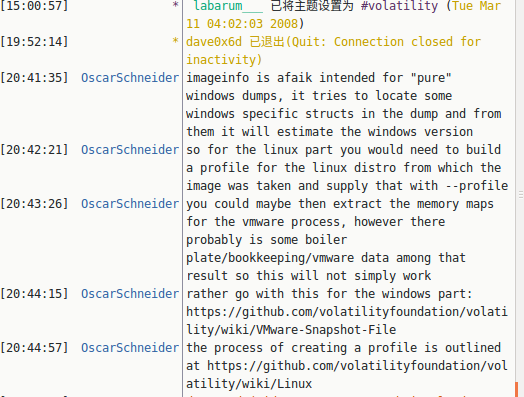
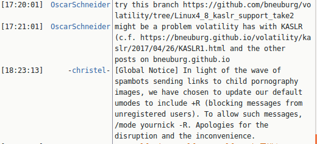

#### 前言 : 简介

这个月开始使用`Volatility`进行内存取证，以及密码提取相关。还顺带玩了把 `Lan Turtle`以及`Leonarde`。 `Leonarde`只是用来模拟键盘，算是比较限制吧。`Lan Turtle`则功能十分强大。

`Volatility`可谓享有盛名，在我使用的过程中，越发佩服作者。厉害了。

#### Step 1 : 获取内存镜像

要想对镜像进行分析，首先肯定是要获取到内存镜像

* windows 

> 非常简单,直接使用[dumpit.exe](https://github.com/mylamour/-_--Forensics-Tools/raw/master/utils/DumpIt.exe)即可,对远程的话可以采用`F-Response`. `Windows`下其实有很多的工具可以进行内存镜像。这里就不一一介绍了。

* linux
> 稍微复杂一点需要使用到`LIME`,之前还可以用`dd`,但是现在`linux`不允许`dd`读取超过`1M`的空间。

```bash
$ git clone https://github.com/limetext/lime
$ cd src
$ make
....
  CC [M]  /home/mhl/Downloads/src/tcp.o
  CC [M]  /home/mhl/Downloads/src/disk.o
....
$ sudo insmod lime-4.10.0-30-generic.ko "path=/home/mour/ubuntu_test1704.lime format=lime"
```

#### Step 2 : 分析的前提条件，要有个`profile`

得到内存镜像之后，可以准备进行分析了。而进行分析的前提的条件是根据`profile`文件。`profile`文件其实就是将内存映射文件和调试信息压缩放在一起，由`volatility`然后框架进行读取。`Windows`和`Linux`有一点不一样，就是`Windows`下的`profile`的可以迁移使用，所以有时候也会建议好几种版本。但是`Linux`下的则不一样，必须是要求：

* CPU架构一致
* 内核版本一致
* 发行版本一致

官网给出的[制作教程](https://github.com/volatilityfoundation/volatility/wiki/Linux)在这里，但是已经有些不适用了。目前已经有更加方便的方法了。

1. 查看内核版本，安装下相应的`Header`文件

>  

2. 制作`dwarf`文件

> 这一步在原始教程里十分的繁复，其实新版本的`volatility`早已经写好了一个`makefile`脚本进行整个套路。

```bash
$ cd volatility/tools/linux
$ make

```
3. 合并`System Map`文件和`dwarf`文件


4. 将`profile`放置在对应的文件夹下`volatility/volatility/plugins/overlays/`,但是记住，千万不要一次性加载`profile`文件，需要什么加载什么。因为`volatility`会加载所有插件，所以导致十分慢。


#### Step 3 : 自古深情留不住,总是套路得人心

常规套路:扫描得到内存镜像信息(已经知道就不需要了，可以直接指定`profile`了)。

然后使用对应的`profile`进行分析。还可以加载不同的插件进行相应的分析。

* 查看支持的Profile

> `python vol.py --info | grep Linux`

可以将自制的`profile`放置在`volatility/plugins/overlays/`下面，然后使用命令查看`profile`名称并进行使用

1.Windows 平台

* Dump 内存中的所有dll, 到本机

> `python vol.py -f win7.vmem --profile=Win7SP1x64 dlldump -D dlls/`

* 查看Windows的进程

> `python vol.py -f win7.vmem --profile=Win7SP1x64 pslist`

* 查看所有的网络通信

> `python vol.py -f win7.vmem --profile=Win7SP1x64 netscan`

* 查看所有的句柄

> `python vol.py -f win7.vmem --profile=Win7SP1x64 handles`

* 查看命令行历史
* 查看注册表，等等等等

其实我们从`wiki`里就可以看到，volatility支持的操作，主要感兴趣的在(以下为`windows`下)

* Image Identification
* Processes and DLLs
* Process Memory
* Kernel Memory and Objects
* Networking
* Registry
* Crash Dumps, Hibernation, and Conversion
* File System
* Miscellaneous

一个个列举也没什么意思，还有就是`Volshell`比较有用，当然配合`yara`还可以检查内存是否存在病毒。

`volshell`可以对内存镜像进行交互式的操作，命令行能干的
shell里都能够干。[原文](https://github.com/volatilityfoundation/volatility/wiki/Command-Reference#volshell)照抄一下：

* List processes
* Switch into a process's context
* Display types of structures/objects
* Overlay a type over a given address
* Walk linked lists
* Disassemble code at a given address

#### Step 4 : 提取密码和一些好玩的套路

提取系统密码，是最基本的啦，Windows的登录密码加密方式有`NTLMV1`和`NTLMv2`。`Windows 7`及以前的是`NTLMV1`实现的，`python`中可以利用这样的代码生成

```python
import hashlib,binascii
hash = hashlib.new('md4', "sad".encode('utf-16le')).digest()
print (binascii.hexlify(hash))
```
提取方式:
`$ python -f xxxx.vmem --profile=Win7SP1x64 hashdump`
之前文档里面一直提到需要首先找到基地址，然后找到偏移地址才可以进行。实践发现并不需要。

当然在有管理员权限的情况下，可以直接使用`mimikatz`(`windows`)提取。即可以交互进行，也可以一行命令行提取(这个是使用了`log`选项)。
`mimikatz logs "privilege::debug";sekurlsa::logonpasswords` 想想使用`Leonarde`加在一起是不是猥琐的不行，不过`leonarde`模拟虚拟键盘也有一大堆的问题。我是参考的[这篇文章](http://www.freebuf.com/sectool/107242.html),对我来说还好吧，改了改代码能用。不知道为什么评论区有那么多问题。不过确实不少问题，还好都解决掉了。

提取浏览器密码:

> 得到浏览器进程，使用`vad`插件`dump`出整个进程空间，然后分析`grep`搜索关键字。

其实最简单的就是使用`WinHex`直接搜索内存镜像，使用`grep`也一样。

过锁屏提取密码:

使用`Lan turtle`,这个是真邪恶，同时还可以用来过锁屏，利用的是`Responder`认证机制漏洞。不过呢,利用条件也很苛刻，起码在win7上，不能有选择网络位置，否则不行。只有无线的话，插上去也不行。但是`hak5`上演示的时候有的是可以的。
这个我觉得`Lan Turtle`的好处就是隐藏自己，探视内网。我不建议直接启用`Quick Cred`,应该只反向一个`ssh`或者`meterpreter`,然后再去启用`Reponder`	去投毒。
避免被发现。挑一个时间去执行。当然这个对`linux`没有用。我也只在一台`win10`上测试成功了。


#### Step 5 : 病毒分析与重建二进制

VAD(Virtual Address Descriptor)是内存取证中的重要参考。

* [病毒分析](https://github.com/volatilityfoundation/volatility/wiki/Command-Reference-Mal):
1. 命令行配合`yara`去扫描规则
2. 主要进程分析，多余dll分析，以及其他。进程注入分析，网络行为，等等吧。手动。。。。还可以绘制出`vadmap`的图，可以用`graphviz`打开的。

* 创建二进制
其实不应该单独拿出来了讲，听着名字很牛逼的感觉，其实就是抽取进程，和前面的一样的。使用`vaddump`

#### Not FAQ
* 内存镜像时会捕捉到宿主机的整个镜像，如果宿主机中有虚拟机正在运行，同样也会被捕捉到。现实中也常常是这样，那么此时应该怎么办?

> 可以先解压出`vmware`进程的地址空间，然后再去用对应`profile`分析对应的`Vmware`内的操作系统。



* `Linux Kernel 4.8`以上的内核采用了随机内存地址，此时该怎么办？



* 文件分散存储在磁盘上，运行时读取到一段连续的内存中。但是`PE`文件是由操作系统读取到内存中，所以内存映射稍有不同，具体哪里不同，我也没看到资料。

* `raw` 与 `dmp` 与 `vmem`

* 注意看一下，`profile`压缩包里面是否需要有目录结构。我之前没有加也可以用，但是自带的`profile`里有的。

* `powershell.exe -command start-process powershell -verb runAs`

* `Rekall`也是很不错的内存取证框架。

#### Conclusion：

* 如何编写`volatility`插件

今天试用期结束，又要开始新的项目了`windows木马检测`。逐渐发现了公司的一些问题。公司比较缺乏技术交流的氛围。自己便和另外一个同事组织了一下搞起了这个。这其实从另一个方向说明了越是那些正常的，越是难以实现。必须是经历过许多的坎坷(或者不需要)才能建立出一个给人感觉自然的，方便的，正常的。自己以前一直觉得很正常的东西，推行起来还是有问题的。
唉，东西一段时间不用就会忘掉。其他几门语言忘掉了许多了。

公司里面有个大神每周来着分享，据说有20年互联网的经验，是老板请的贵客。之前还在启明星辰带过团队，履历挺牛逼的，大家也都觉得很牛逼的。我也觉得他`C++`和`Python`很牛逼。盛名之下，其实难副。也是一言难尽吧。人倒还是不错。

#### Resources

* [LIME](https://github.com/504ensicsLabs/LiME)
* [F-Response](https://www.f-response.com/software/ee)
* [Volatility Wiki](https://github.com/volatilityfoundation/volatility/wiki/)
* [Volatility Malware Find](https://github.com/volatilityfoundation/volatility/wiki/Command-Reference-Mal)
* [volatility simple tutorial](http://www.hackingarticles.in/volatility-an-advanced-memory-forensics-framework/)
* [Creating a profile](https://github.com/volatilityfoundation/volatility/wiki/Linux#creating-a-new-profile)
* [PEB]()
* [VAD: Understanding Virtual Address Descriptors](http://lilxam.tuxfamily.org/blog/?p=326&lang=en)
* [Managing Virtual Memory](https://msdn.microsoft.com/en-us/library/ms810627.aspx)
* [rainbow crack](http://project-rainbowcrack.com/)
* [Kernel Address Space Randomization in Linux or how I made Volatility bruteforce the page tables](https://bneuburg.github.io/volatility/kaslr/2017/04/26/KASLR1.html)
* [What is dwarfdump](http://wiki.dwarfstd.org/index.php?title=Libdwarf_And_Dwarfdump#What_is_dwarfdump)
* [LAN Turtle](https://lanturtle.com/)
* [-_--Forensics-Tools](https://github.com/mylamour/-_--Forensics-Tools/)
* [mimikatz](https://github.com/gentilkiwi/mimikatz)
* [mimikatz取虚拟机内存镜像](http://carnal0wnage.attackresearch.com/2014/05/mimikatz-against-virtual-machine-memory.html)
* [Responder](https://github.com/SpiderLabs/Responder)
* [snagging-creds-from-locked-machines](https://room362.com/post/2016/snagging-creds-from-locked-machines/)
