# 前言

先讲一下通过这次阿里云安全算法比赛学到了什么东西。

* 修改了下autoclf的框架，增加了debug,evaluation等
* 学习了下LGB的原理(效果确实比XGB好一些)
* 统计分析恶意软件的api调用去对应到相应的特性
* awk一些新的数据处理用法
* 调优和发现数据的问题

# 预处理

数据的原始格式每行的记录是恶意软件在沙箱文件的api调用，如下所示，分别有文件编号，文件类型，API的名词，调用的线程，返回值，以及顺序。
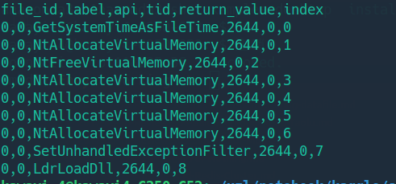

文件挺大的，1G解压下来要14G，pandas读的话至少64G的内存。所以GG.先来处理一下。直接用的awk去处理的，把每个文件的整个file_id单独存放起来。
`awk -F "," '{print $0 > ("FILE" $1)}' train.csv`
这样就可以得到
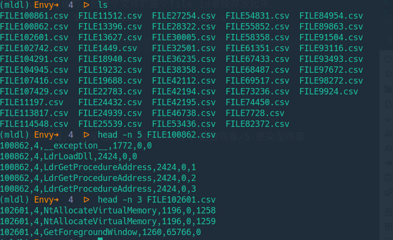

但其实有一个问题，因为有的机器会提示，can't open too many file.所以只能通过close的方式去处理，但会导致很慢。

`awk -F "," '{print $0 >> ("FILE" $1); close("FILE" $1)}' train.csv
`
处理完之后还需要把所有的文件分类移动到单独的文件夹

```shell
for item in $(ls $PWD/FILELIST/)
do
    fpath=$PWD/FILELIST/$item
    ftype=$(head -n 1 $fpath | awk -F, '{print $2}')
    case $ftype in
            0) echo "正常文件" | mv $fpath traintype/0 ;;
            1) echo "勒索病毒" | mv $fpath traintype/1 ;;
            2) echo "挖矿程序" | mv $fpath traintype/2 ;;
            3) echo "DDoS木马" | mv $fpath traintype/3 ;;
            4) echo "蠕虫病毒"  | mv $fpath traintype/4 ;;
            5) echo "感染型病毒" | mv $fpath traintype/5 ;;
    esac
done

```
同时，还做了关于api的调用统计并单独放置的。

```shell
for i in {0..5}
do
    echo $i
    for f in $(ls $i)
    do
        echo $i/$f
        cat $i/$f | awk -F , '{print $3" "$4" "$5}' | sort |  uniq -c | sort -bgr > "$i""summary"/$f
    done
done 

```
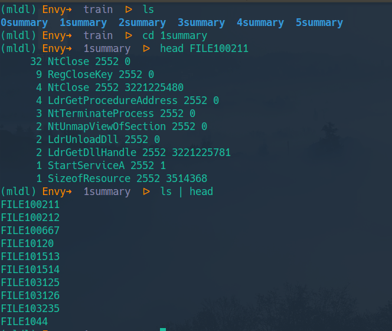

完整shell脚本见引用。


# 特点与统计分析

一共6类，0-正常/1-勒索病毒/2-挖矿程序/3-DDoS木马/4-蠕虫病毒/5-感染型病毒。先来说说做这个的思路，学弟用的是tfidf特征，按照文本分类去做的。效果还不错。

1. api的调用统计，即上面图中的各个summary去训练
2. api调用的顺序拿出来，去重，然后和0类的相比较，去重，然后训练。
3. 当成文本分类来做，tfidf特征

选择算法的过程，最好跑一遍算法，选出较好的，然后GridSearch,进行Ensembe learning。不过对于我来说，这次更希望通过比赛，来增加以后对恶意软件的分析能力。先说一下前两中的方式使用summary的训练得到的是log_loss分别是:

| summary\log_loss | 0/1     | 0/2   | 0/3   | 0/4     | 0/5     |
|------------------|---------|-------|-------|---------|---------|
| xgb              | 0.00594 | 0.014 | 0.013 | 0.00359 | 0.11094 |
| lgb              |         | 0.012 | 0.006 |         | 0.05    |


logloss很小的就没用xgb重新跑，把所有summary的logloss一起跑的话，logloss为0.13左右(这已经是个很高的了)，但是到了线上居然会大于1.2。所以可想而知。同样的，采用第二种方式去训练，即把api调用拿出来去重，然后训练。

| apis\method | xgb        | lgb       |
|-------------|------------|-----------|
| log_loss    | 0.77228245 | 0.6040165 |

当然看起来这个logloss也不好，不过只是选择了1/5的0类型样本去计算，其实应该是选择全量比较好。NN的方式，其他队伍最好的在0.1附近左右徘徊。
第三类的方法看起来是做好的了，因为学弟已经靠着这个打到了A榜第6，loss在0.06左右。虽然现在我们提升到了0.049，但却已经掉到了B榜第8.那么问题来了，数据集还有哪些问题，后来问到别人才知道，训练时的恶意样本分布比较接近，都是file1122,file1123这种是恶意样本。 而且有一部分的样本是重复运行后的得到的。不过屁话先到这，由于之前并没有用到安全方面的知识，似乎不采用相关的知识，也可以得到很好的结果，但是我们还是应该从安全的角度分析一下，而且每个类型下面的又有不同种的划分，比如3-ddos类的，也有终断型的，也有直接内存填到死的。这些恶意软件的代码一般来讲都是短小精悍，先到系统里加载dll，然后再去释放。下面简单记载一些分析和trick。

* 0-正常

某些api序列会在一定时间后重新调用，就是一些行为模式，会在后面接着出现，而且整个api的调用显的比较均匀。


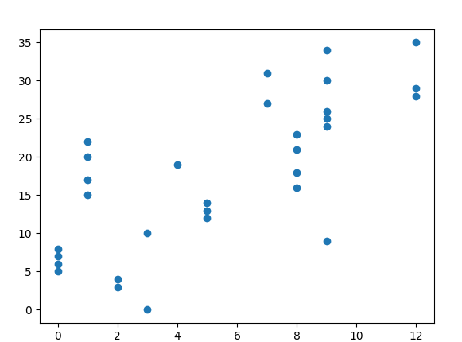

* 1-勒索病毒

特点是，大量的读写，对文件进行操作。以及调用加密函数。80%以上会调用crypt族的函数，CryptHashData等，但是调用的频次并不高。，以及读文件的读写，可以看到的出现比较多的就是LdrLoadDLL。NtDeviceIoControllFile。
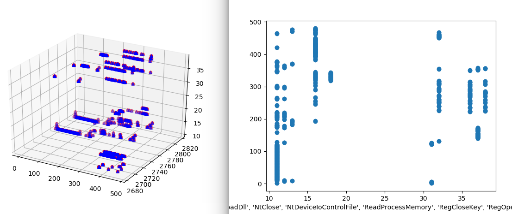
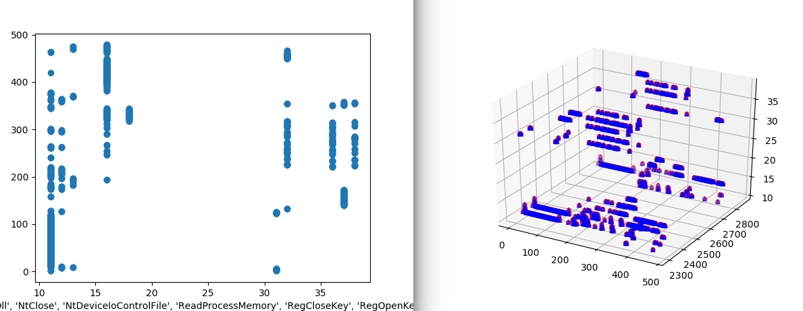
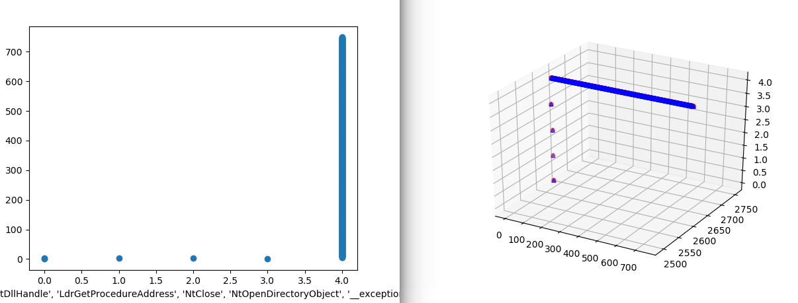

* 2-挖矿程序

特征非常明显，多线程齐进行，网络的操作较高，同时需要创建文件(因为有的要同步块)。这还是在用第二种特征筛选方式时发现的，后来就通过图形可视化看了一下。但是也有问题的是，有聪明的挖矿的，会只占用一个tid序列。即占用一核进行挖矿。
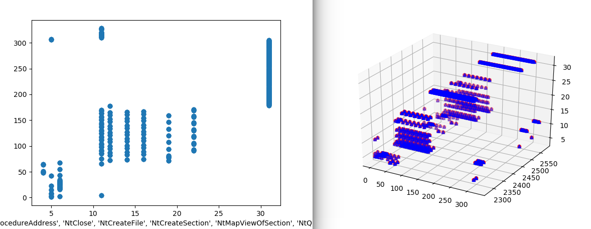
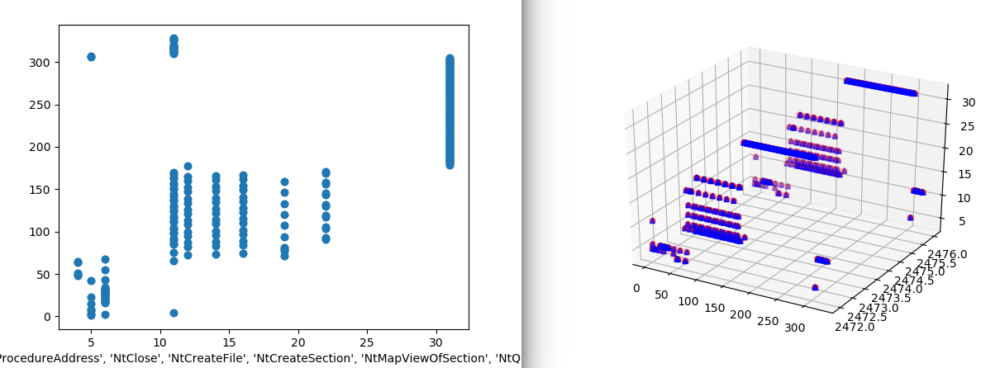
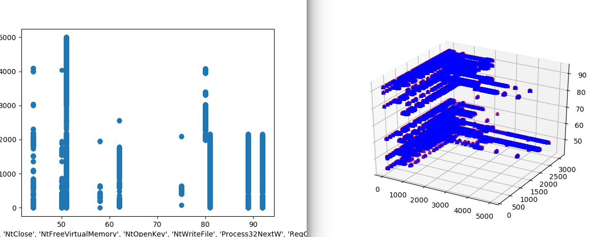

* 3-DDoS木马

这个分析的时间最多。特点是拒绝服务，有终止进程的，内存填满的。还看到弹窗致死型的。当然更详细的类型可以看[DDOS type](http://resources.arbornetworks.com/wp-content/uploads/INFO_DDoSAttackTypes_EN.pdf)

在这些api的调用中，大量的是GetSystemMetrics, NtClose, NtAllocateVirtualMemory,以及对注册表的操作API等,很明显的一个特征是，多进程，这些api在不同的tid上调用系列一致。但和挖矿的相比，虽然同是多线程，调用的API也差不多，但是调用的数量远远大于挖矿病毒。

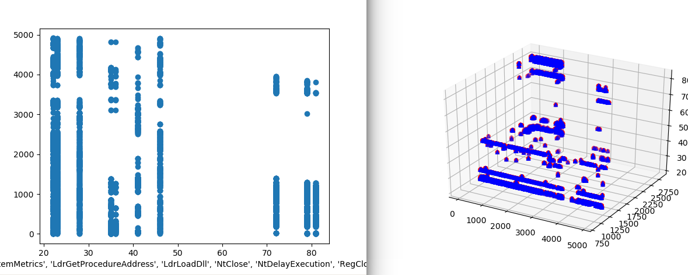
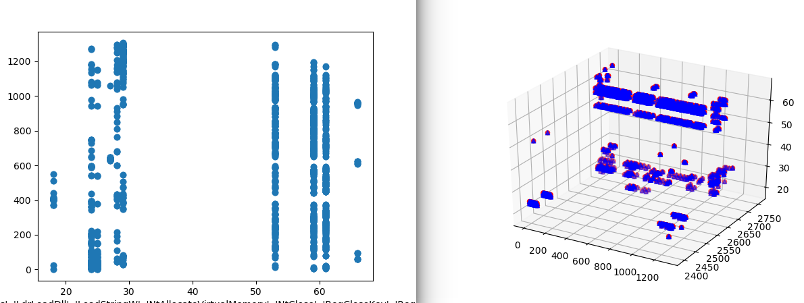
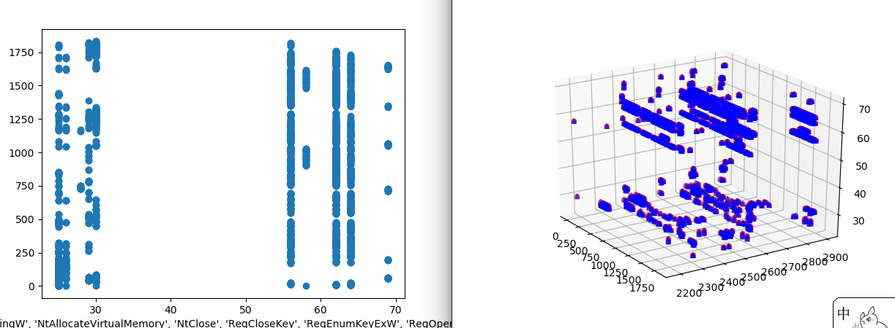


* 4-蠕虫病毒

特点是复制自身，感染其他机器。2d图不太好看，看3d的图，似乎是每个都在生长成以前的tid序列一样。是有顺序断层的。也不像挖矿和DDOS一样多个线程的是一样的api调用序列。似乎其他的tid序列都在像最全的一个tid序列生长。

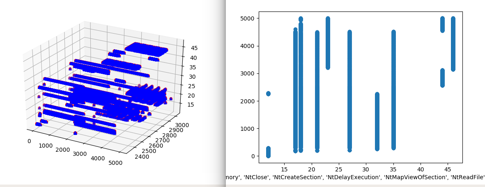
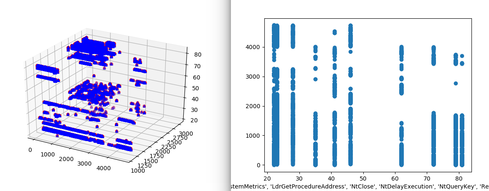
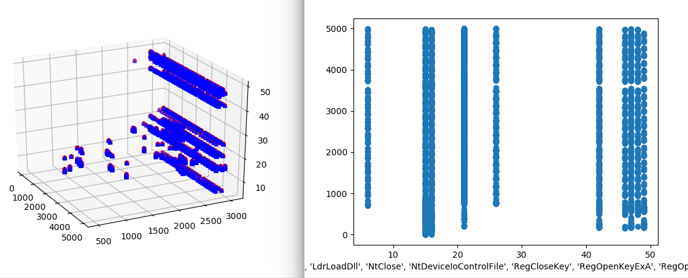


* 5-感染型病毒

这个对于我来说最难分析的一种，一直是按照病毒去分析的，没想到只是指感染型病毒。实话来讲，没看出什么门道，虽然他有3000多个样本。但是却是最难分析的，特征很不明显，从之前的批量算法中也可以看到，他的loss也是最高的，也正是由于该类别的loss很高，导致拉低整体水平。但是从三维图上看，旋转到不同的角度，都能得到一个很好的重合，不知道这个算不算。仍然待研究。

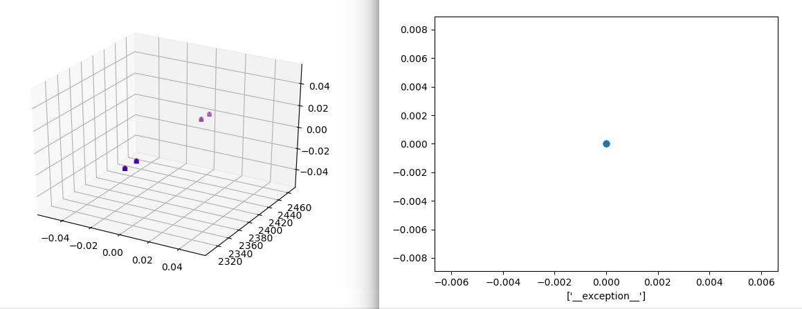
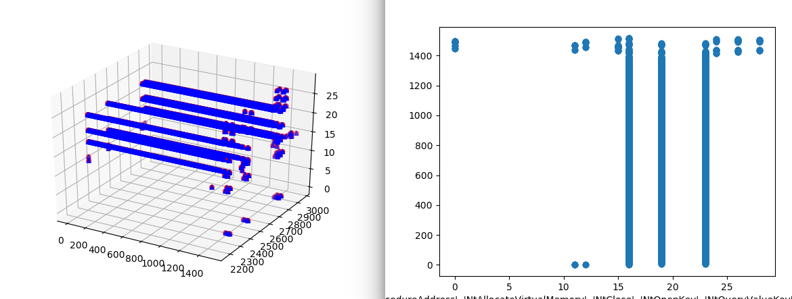
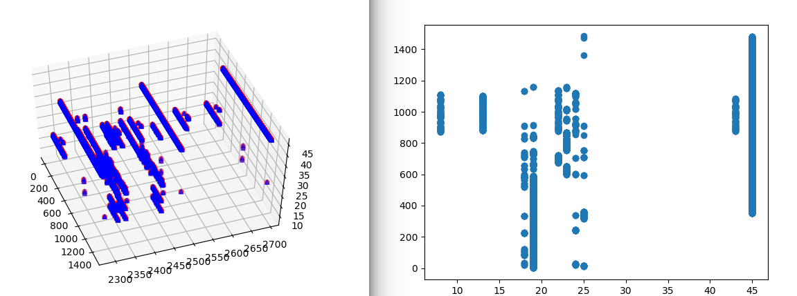
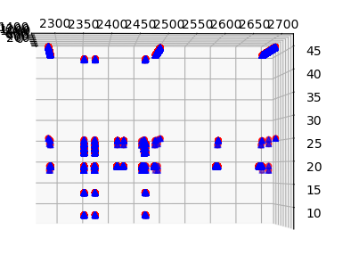
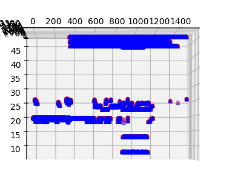


# 其他

* 这些恶意软件的代码让人感到非常的”美“。运行起来也是，记得以前看Mirai的代码时，就觉得很棒。

* 其实还有很多其他的事情要去做

* 如果我hook到内核统计下调用的信息，是不是就可以通过这些信息去分析了？但是信息量会不会过大？直接先通过硬性指标分析怎么样？
 


# Reference

* [预处理脚本](https://ghostbin.com/paste/7qrx2)
* [可视化脚本](https://ghostbin.com/paste/dyfqc)
* [DDOS type](http://resources.arbornetworks.com/wp-content/uploads/INFO_DDoSAttackTypes_EN.pdf)
* [Windows恶意软件API调用特征分析](http://www.4hou.com/technology/3267.html)